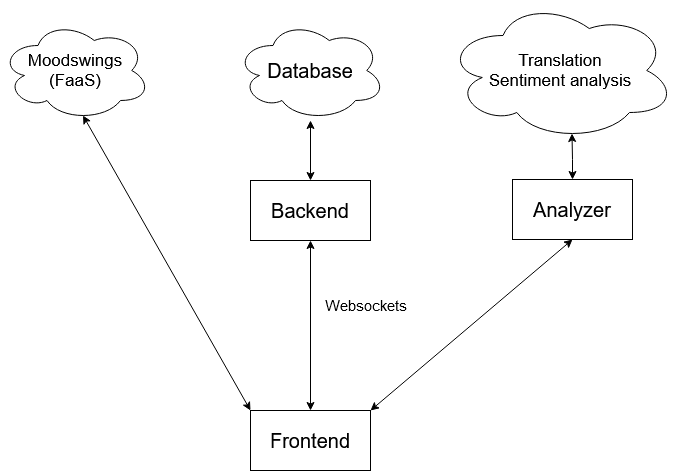

# PCD Homework 2

## Team
- Mihai Constantin (MSAI1)
- Iulian Vultur (MSD1)
- Hutu Alexandru-Dumitru (MSD1)

# About

We developed a chat application that allows people to talk in multiple languages while understanding each other. The main features include:

- find people to chat with in real time (users are automatically paired up)
- translate the messages in your native language
- detect text in images and translate it
- check the general sentiment of a message to better understand its meaning (positive, negative)
- see the moodswings factor (how greatly the general sentiment varies)

# Architecture

  

## Backend

- **Server**: Node.js
- **Reverse Proxy**: Nginx
- **Database**: Google Cloud SQL
- **Websockets**: socket.io

## Analyzer

- **Server**: Python (Flask) - Google AppEngine
- **Translation**: Google Translation AI
- **Sentiment Analysis**: Google Natural Language AI
- **OCR**: Google Vision AI

## Moodswings

- **FaaS**: Google Cloud Functions

# Deployment

The backend and frontend components were depoyed on a Vultr VPS (Cloud Compute) located in Amsterdam, Netherlands. Specifications:

- 1 vCPU (Intel Regular Performance)
- 1GB RAM

# Performance analysis

The delay between HTTP responses from the deployed server was tested.

- **Average HTTP Server Delay**:

The biggest bottleneck of the application consists of the cloud components (more specifically, the database along with all the translation and analysis components). The delay between when a message is sent and when it arrives is neglibigle when compared to the delay caused by the cloud components.

Therefore, only the delays of the cloud components were tested.

Average delay:

- **Database**:
- **Translation and Sentiment Analysis**:
- **Moodswings FaaS**: